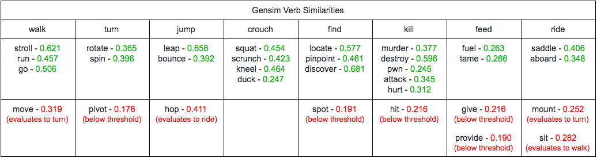
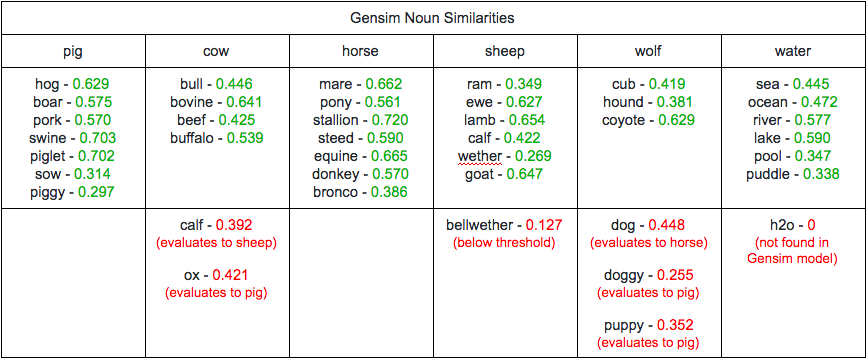
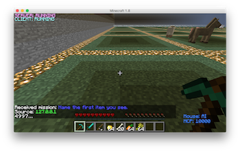
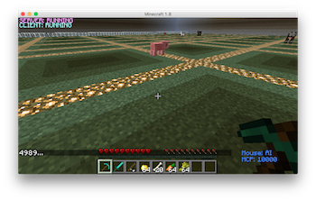
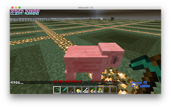
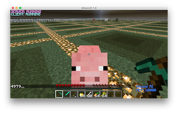

## Video 

## Project Summary
Welcome to Chatty’s World! Chatty is our Minecraft agent, who is placed in a world full of animals, and given a handful of items to interact with his environment. The objective of Chatty’s World is to allow a human user (like you) to control Chatty’s actions through a command prompt. To succeed in this goal, we focused on two areas: the Natural Language Processing (NLP), which interprets user input, and the implementation of agent actions, where we wrote code to carry out specific tasks.
 
The challenge that comes with interpreting user input is that there are an infinite number of possible queries that a human can request. Within the NLP section of our project, we strive to make sense of the English language to the best of our ability. The goal of our NLP system is to identify the verb that corresponds with the user’s desired action, along with the subject or any other information that makes the query more specific. For example, a user may want Chatty to “walk”, and can further specify how far Chatty should walk or even where he should walk to. Thus, we must focus on the keywords of the user input to accurately predict the action that the user intended.
 
After interpreting user input, the next step is to perform the predicted action. There are several basic movement commands that are provided by Microsoft’s Malmo API that we used to create more complex and interactive commands, such as walking to or killing entities. Our goals in relation to Chatty’s actions are to maximize the number of action-functions, so that the user has more options to do as he or she wishes, and also to make these functions as efficient and human-like as possible. The challenges behind these problems are that we are limited to what we can do by what is possible through the Malmo API. This required us to be as creative in coming up with action-ideas relevant to Chatty’s Minecraft environment, and knowledgeable in Minecraft/Malmo to discover if and how these ideas were possible.

## Approaches

### Natural Language Processing
 
Within our NLP system, we are making use of two external libraries to help us interpret language: the Natural Language Toolkit (NLTK) and Gensim. The first thing that we do upon receiving user input is split it by commas, as well as the conjunctions “and” and “then”. We do so to handle compound sentences, such as “kill a pig, kill a cow, and kill a sheep” or “find the water, then go fishing”. Splitting the input in this way creates a queue of commands to be interpreted in order, which will also be executed in order in the future.
 
For each command in the queue, we use NLTK functions to tokenize and perform Part-of-Speech tagging on it. With the tagged tokens, we then select the verb and any optional subsequent information, such as a noun (e.g., “pig”, “water”), direction (e.g., “right”, “left”), or number (for example, to specify number of steps to walk). If a verb is not specified before an argument, or not specified at all, the comman will be considered inavlid. Otherwise, the verb will be linked to a specific action-function, and the additional information will be passed into this function as an argument. Below is a table listing all of the verbs that are linked to actions-functions and all of the words/values that are linked to valid arguments.

 
In our approach thus far, our NLP system will successfully interpret commands like “find a pig”, but is unable to do so for commands like “locate a boar”. These two have the same meaning, but our system does not yet account for synonyms. The Gensim library will help us with NLP through the use of word vectors, so that each word that we examine from the user input will have its own unique vector representation. This requires the use Gensim to train/build a word2vector model, from which we can find a word’s associated vector. We build our model using Google's GoogleNews-vectors-negative300.bin file. With this, we can now compare the keywords of the user input to the words that our system already recognizes, by finding the cosine similarities between them. Doing so, a verb like “locate” will be linked to “find”, as the cosine similarities between these two words will be the highest, while those between pairs like “locate” and “kill” would be relatively low. In the same way, the word “boar” would be linked to “pig”. We also set a threshold, so that if a token does not have at least a 0.3 cosine similarity with its best match, then it will not be considered valid. We determined this value to be appropriate after lots of trial and error. Our NLP system can now interpret a much wider range of queries, as different verbs and arguments can be used to perform actions.

### Action Functions

To create actions for our agent to perform, we make use of Malmo's InventoryCommands and movement commands (AbsoluteMovementCommands, ContinouousMovementCommands), as well as Malmo's ObservationFromRay, ObservationFromNearbyEntities, and ObservationFromFullStats. Malmo provides several commands for simple movement, such as walking and turning, which we use to create more specific and complex commands. Receiving the Malmo world state observations is extremely crucial to the success of our created commands, as observing the world is necessary to complete tasks such as finding entities (ObservationFromNearbyEntities). In order to find a pig, we must check for the pig entities within our observation, grab their coordinates, and compare them with our agent's coordinates. In our “find” function, we calculate the Euclidian Distances to see which pig is the closest, then use movement commands to walk to the location, until the pig is observed to be in our LineOfSight and in range (for striking or feeding) from ObservationFromRay. In a simple example of how this works, observe the figure below.

 
Here, Chatty is represented by the smiling face and the pig is represented by the pig face. Each square in this grid represents a block on the map. As denoted by the red lines, we find the differences between Chatty’s and the pig’s  x and z coordinates, and use these lengths to calculate the hypotenuse of the triangle (Euclidian Distance), which is denoted by the blue line. With knowledge of the triangle’s side lengths, we can also perform a simple SOHCAHTOA calculation to find the angle that Chatty must turn to face the pig (denoted in yellow). Through the “setYaw” command found in the AbsoluteMovementCommands, we can position Chatty in the correct direction, and simply walk the length of the hypotenuse to reach the pig, using a walk function that we defined using the “move” command found in the ContinuousMovementCommands. 
 
The “find” function is the most important, as many of our other created functions, such as “kill”, “feed”, “ride”, and “fish” make use of it. For the “kill” function, our agent must continously call upon the “find” function to locate an entity, and strike until the ObservationFromFullStats updates to reflect that Chatty has killed a mob. Similarly, “feed” will require the finding of the targeted entity, followed by the selection of the correct food from Chatty’s inventory (using InventoryCommands) to be used on it. “Ride” will require the finding of a horse before attempting to mount it. Lastly, our “fish” function will first need to find water, then have Chatty cast his fishing rod until ObservationFromNearbyEntities tells us that the fishing hook’s y-coordinate has dropped significantly (representing a bite) or after 30 seconds have passed, at which point Chatty reels in his line. 

## Evaluation

### Quantitative Evaluation
While the success of our action-functions is discrete, in which the results that they produce are essentially the same upon each call, we focused our quantitative evaluation on our project’s ability to find synonyms/similar words with Gensim, and make the correct action-function calls with the correct arguments. To do so, we found several synonyms for each of the recognized verbs and nouns/arguments, and checked if these synonyms were interpreted correctly, by matching with their intended meaning. In the tables below, you can view the results of this evaluation, where the cosine similarity between each subject and synonym is provided.

Within these tables, the results in green represent those which were successful (cosine similarity above 0.24 threshold and closest-matched with target word), and those in red represent results that were unsuccessful (the reason behind its failure is also provided). Though it may not include every single synonym for each word, we did our best to evaluate realistic lists of the terms that a user could use. Through our results, we can see that our Gensim model did a fairly good job at interpreting the synonyms correctly. [23 out of the 32] verbs and [33 out of the 40] nouns that we tested were successful, with ~72% and ~83% accuracies, respectively. With this success rate, commands such as “find the horse and kill the pig” can now be worded in different ways like “pinpoint the pony then pwn the pork”, “locate the stallion then murder the boar”, or “discover the steed then attack the swine”. We also placed the unsuccessful synonyms in a word net, so that if the word is inputted by the user, the Gensim results will be overridden, and the correct action will be performed. With the word net in place, each synonym within the tables above will be interpreted correctly, with a 100% success rate. Any synonyms that were not found in the tables above will be evaluated and interpreted by its cosine score, which we are confident in, given the success of our Gensim model.

### Qualitative Evaluation
To measure the success of our project in a qualitative way, we focused on user experience, in both the NLP system and agent-actions. For the NLP section, we discuss how easy and/or complex making a valid query can be. In the agent-action section, we touch on how human-like our action-functions appear to be. These are crucial points in making Chatty’s World both easy to use and visually appealing. 
 
Through our NLP system, the user has the ability to execute a single command at a time, line by line, or multiple commands at once within the same line, separated by commas and/or conjunctions (“and”, “then”).  This gives the user the freedom to make perform as many commands as they’d like at a given time, but also places rules on how a command should be structured, as “kill pig, kill cow” would be valid, but “kill pig kill cow” (without the comma) would not be. This could be an inconvenience to the user, but at the same time, follows proper English grammar, and is not too difficult to avoid (requires one extra character!). For each clause in a query to be valid, a user must always input a verb, and the verb must come before any arguments. With this said, queries like “feed the cow” or “feed cow” will be executed, while others like “cow the feed” or “ cow feed” will not produce the desired results. We decided that user input must follow this structure, so that queries always represent their true meaning, e.g., “cow feed” may intend to “feed cow”, but has a completely different meaning. Regarding queries of this nature, we felt that it was appropriate to only handle user input that is structured in a sensible manner. At this time, a part of our NLP system that can be seen as a pitfall is its inability to handle certain compound queries like “feed and kill a pig”. A query like this would be able to kill a pig, but not feed it, as the argument “pig” is not specified within the first clause. The same idea applies to unspecific queries such as “kill it”. Other than these rules and shortcomings, our NLP system gives the user freedom to enter any query that he or she desires, and understands a wide range of vocabulary, resulting in a relatively straightforward and satisfying experience.
 
The way in which Chatty’s actions are executed is important to the success of our project; as mentioned earlier, we would like these to be as human-like and efficient as possible. The first way we succeed in this is through Chatty’s response time, as Chatty performs the given command immediately. While the “find” function is the most relevant action-function that we created, we improved upon this since the Status Report in two ways: by changing Chatty’s path to a given entity to use the Euclidean, rather than Manhattan, Distance, and by implementing his movement through the use of Malmo’s ContinouousMovementCommands rather than AbsoluteMovementCommands. With both of these changes, Chatty becomes more efficient and his movements appear to be much more fluid. Below are pictures of Chatty reacting to the query "find pig". In figure (a), Chatty receives the command, (b) Chatty turns/moves toward the pig, (c) Chatty approaches the pig (d) Chatty finds the pig.

(a)   (b)   
(c)   (d) 

A pitfall in the find command is that Chatty can find his way to a given entity, but be unaware that he has found it. This usually occurs when an entity is angled at a strange position in relation to Chatty; Chatty will successfully move to the entity’s location, but the entity itself will be slightly outside of his crosshairs. This, in turn, can negatively affect the other functions such as “kill” and “feed” that call the upon “find” function, however, the “find” failure occurs very rarely. Another area that can be viewed as a pitfall within our “find” function is that if an entity moves during Chatty’s travel to it, Chatty will finish the course of his original path before readjusting to the new path. Fixing this would require us to refresh Chatty’s observations and calculate the targeted entity’s distance constantly. Because animals do not constantly move (and when they do, the distance is typically insignificant), we felt that although our implementation is less human-like in this area, it was not worth the extra computation to fix. Aside from these issues, the fair amount of action-functions that we implemented are all functional, and performed smoothly by Chatty, resulting in an interesting and diverse experience for each user.

## References

<a href="https://www.microsoft.com/en-us/research/project/project-malmo/">Project Malmo API</a> 
<a href="http://www.nltk.org/">Natural Language Toolkit Library</a> 
<a href="https://radimrehurek.com/gensim/models/word2vec.html">Gensim Word2Vec Library</a> 
<a href="https://drive.google.com/file/d/0B7XkCwpI5KDYNlNUTTlSS21pQmM/edit">Google's Trained Gensim Model (GoogleNews-vectors-negative300.bin)</a> 
