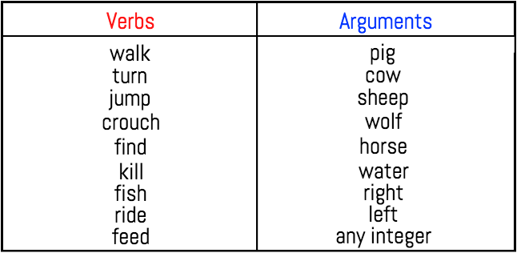
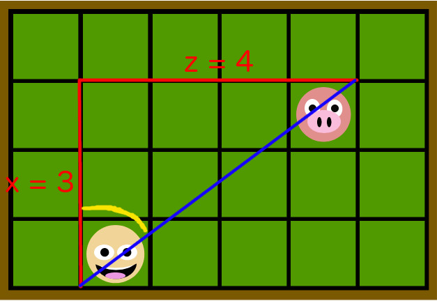

## Video 

## Summary
Welcome to Chatty’s World! Chatty is our Minecraft agent, who is placed in a world full of animals, and given a handful of items to interact with his environment. The objective of Chatty’s World is to allow a human user (like you) to control Chatty’s actions through a command prompt. To succeed in this goal, we focused on two areas: the Natural Language Processing (NLP), which interprets user input, and the implementation of agent actions, where we wrote code to carry out specific tasks.
 
The challenge that comes with interpreting user input is that there are an infinite number of possible queries that a human can request. Within the NLP section of our project, we strive to make sense of the English language to the best of our ability. The goal of our NLP system is to identify the verb that corresponds with the user’s desired action, along with the subject or any other information that makes the query more specific. For example, a user may want Chatty to “walk”, and can further specify how far Chatty should walk or even where he should walk to. Thus, we must focus on the keywords of the user input to accurately predict the action that the user intended.
 
After interpreting user input, the next step is to perform the predicted action. There are several basic movement commands that are provided by Microsoft’s Malmo API that we used to create more complex and interactive commands, such as walking to or killing entities. Our goals in relation to Chatty’s actions are to maximize the number of action-functions, so that the user has more options to do as he or she wishes, and also to make these functions as efficient and human-like as possible. The challenges behind these problems are that we are limited to what we can do by what is possible through the Malmo API. This required us to be as creative in coming up with action-ideas relevant to Chatty’s Minecraft environment, and knowledgeable in Minecraft/Malmo to discover if and how these ideas were possible.

## Approach

#### NLP
Within our NLP system, we are making use of two external libraries to help us interpret language: the Natural Language Toolkit (NLTK) and Gensim. The first thing that we do upon receiving user input is split it by commas, as well as the conjunctions “and” and “then”. We do so to handle compound sentences, such as “kill a pig, kill a cow, and kill a sheep” or “find the water, then go fishing”. Splitting the input in this way creates a queue of commands to be interpreted in order, which will also be executed in order in the future.
 
For each command in the queue, we use NLTK functions to tokenize and perform Part-of-Speech tagging on it. With the tagged tokens, we then select the verb and any optional subsequent information, such as a noun (e.g., “pig”, “water”), direction (e.g., “right”, “left”), or number (for example, to specify number of steps to walk). The verb will be linked to a specific action-function, and the additional information will be passed into this function as an argument. A command without a verb will be considered invalid, as it does not specify an action for Chatty to take. Below is a table listing all of the verbs that are linked to actions-functions and all of the words/values that are linked to valid arguments.

 
In our approach thus far, our NLP system will successfully interpret commands like “find a pig”, but is unable to do so for commands like “locate a boar”. These two have the same meaning, but our system does not yet account for synonyms. The Gensim library will help us with NLP through the use of word vectors, so that each word that we examine from the user input will have its own unique vector representation. This requires the use Gensim to train/build a word2vector model, from which we can find a word’s associated vector. We build our model using Google's GoogleNews-vectors-negative300.bin file. With this, we can now compare the keywords of the user input to the words that our system already recognizes, by finding the cosine similarities between them. Doing so, a verb like “locate” will be linked to “find”, as the cosine similarities between these two words will be the highest, while those between pairs like “locate” and “kill” would be relatively low. In the same way, the word “boar” would be linked to “pig”. We also set a threshold, so that if a token does not have at least a 0.3 cosine similarity with its best match, then it will not be considered valid. We determined this value to be appropriate after lots of trial and error. Our NLP system can now interpret a much wider range of queries, as different verbs and arguments can be used to perform actions.

#### Action Functions
To create actions for our agent to perform, we make use of Malmo's InventoryCommands and movement commands (AbsoluteMovementCommands, ContinouousMovementCommands), as well as Malmo's ObservationFromRay, ObservationFromNearbyEntities, and ObservationFromFullStats. Malmo provides several commands for simple movement, such as walking and turning, which we use to create more specific and complex commands. Receiving the Malmo world state observations is extremely crucial to the success of our created commands, as observing the world is necessary to complete tasks such as finding entities (ObservationFromNearbyEntities). In order to find a pig, we must check for the pig entities within our observation, grab their coordinates, and compare them with our agent's coordinates. In our “find” function, we calculate the Euclidian Distances to see which pig is the closest, then use movement commands to walk to the location, until the pig is observed to be in our LineOfSight and in range (for striking or feeding) from ObservationFromRay. In a simple example of how this works, observe the figure below.

 
Here, Chatty is represented by the smiling face and the pig is represented by the pig face. Each square in this grid represents a block on the map. As denoted by the red lines, we find the differences between Chatty’s and the pig’s  x and z coordinates, and use these lengths to calculate the hypotenuse of the triangle (Euclidian Distance), which is denoted by the blue line. With knowledge of the triangle’s side lengths, we can also perform a simple SOHCAHTOA calculation to find the angle that Chatty must turn to face the pig (denoted in yellow). Through the “setYaw” command found in the AbsoluteMovementCommands, we can position Chatty in the correct direction, and simply walk the length of the hypotenuse to reach the pig, using a walk function that we defined using the “move” command found in the ContinuousMovementCommands. 
 
The “find” function is the most important, as many of our other created functions, such as “kill”, “feed”, “ride”, and “fish” make use of it. For the “kill” function, our agent must continously call upon the “find” function to locate an entity, and strike until the ObservationFromFullStats updates to reflect that Chatty has killed a mob. Similarly, “feed” will require the finding of the targeted entity, followed by the selection of the correct food from Chatty’s inventory (using InventoryCommands) to be used on it. “Ride” will require the finding of a horse before attempting to mount it. Lastly, our “fish” function will first need to find water, then have Chatty cast his fishing rod until ObservationFromNearbyEntities tells us that the fishing hook’s y-coordinate has dropped significantly (representing a bite) or after 30 seconds have passed, at which point Chatty reels in his line. 
