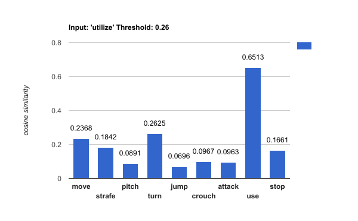
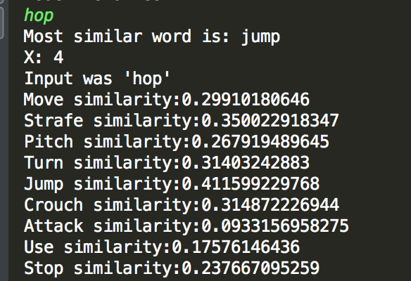

# Chatty's World

## Project Summary

The goal of our project is to implement a Natural Language Processing (NLP) system in Minecraft that will accept and interpret user input, and have the Minecraft agent act accordingly. To understand varying user input, we will make use of language processing tools, such as the NLTK and Gensim libraries. The agent actions will be implemented through the use of Microsoft's Malmo API. Not all inputs can be handled, as there are an infinite number of possible inputs that a user can give, as well as limitations on the actions a Minecraft agent can actually perform. We will start by implementing basic commands (moving, turning, attacking, etc.), then use these, along with world state observations, to build more intricate commands, including (but not limited to) locating entities, killing mobs, fishing, and finding shelter.  

## Approach

Our project is divided into two main parts: (1) the NLP and (2) creating Malmo agent actions. 

(1) Natural Language Processing
We are using the NLTK and Gensim libraries in order to interpret user input, so that we can make the correct action call. Using the NLTK functions, we are simply tokenizing and performing Part-of Speech tagging upon user input, so that we can grab the important verbs and nouns, which associate with commands and parameters respectfully. For example, if a user types "find a pig", we will take the words "find" and "pig" in order to call function "find(pig)". Here, we would link the word "find" to call the find function, and pass the corresponding noun as a parameter. 

The Gensim library will help us with NLP through the use of word vectors, so that each word that we examine from the user input will have its own unique vector resprestation. We will build our word2vector model using Google's GoogleNews-vectors-negative300.bin file. With this, if we encounter user inputs that include verbs/nouns that our NLP system does not recognize such as "locate boar", we will compare the word vectors of "locate" and "boar" with terms that we already know, and link these unknown words to the known words with the highest cosine similarities (if the cosine similarities match a certain threshold). This should successfully match "locate" with "find" and "boar" with "pig", so that "find(pig)" can be called again.

(2) Malmo Agent Actions
To create actions for our agent to perform, we make use of Malmo's InventoryCommands and movement commands (AbsoluteMovementCommands, ContinouousMovementCommands), as well as Malmo's ObservationFromRay and ObservationFromNearbyEntities. Malmo initially provides several commands for simple movement, and we use these to create even more commands. Receiving the Malmo world state observations is extremely crucial to the success of our created commands, as they observing the world is necessary to complete tasks such as finding and/or killing mobs. In order to find a pig, we must check for the pig entities within our observation, grab their coordinates, and compare them with our agent's coordinates. Here, we use Euclidian Distance to see which pig is the closest, then use movement commands to walk to the location, until the pig is observed to be in our LineOfSight and in range (for striking). For a kill-function, our agent must continously call upon the find-function to locate the pig/mob, and strike until the agent notices that the pig/mob is no longer in the world state observations. All of our commands (aside from those provided by Malmo) will use existing commands, and rely on gathering observations from the Malmo world.
	

◦ Evaluation: An important aspect of your project, as we mentioned in the beginning, is evaluating your
project. Be clear and precise about describing the evaluation setup, for both quantitative and qualitative
results. Present the results to convince the reader that you have a working implementation. Use plots, charts,
tables, screenshots, figures, etc. as needed. I expect you will need at least a few paragraphs to describe each
type of evaluation that you perform.

## Evaluation

A big part of our evaluation was to make sure our system was functional. In this milestone, we wanted to make sure that we could approach entities and do some sort of interaction with them. We want to implement a number of commands we could feed our agent, and make sure they execute in a sensible way.

The next part of our evaluation is in our word pairing. The graph below demonstrates how we use the cosign similarity to find the closest matched Malmo command. The input in the example below is with input "utilize" which is paired to the "use" command in Malmo as it holds the highest cosign similarity. The other image is a screenshot of how we tested the cosign similarities within our code using the word "hop." We also included a threshold cosign similarity to filter out the words that did not have a high enough cosign similarity with the valid Malmo commands. For example, the input of "fry egg," would return "Could not find a close match." given a high enough threshold. At this current stage, we set our threshold to be at 0.26. From there, we return the command paired with the highest cosign similarity greater than the threshold. 

◦ Remaining Goals and Challenges: In a few paragraphs, describe your goals for the next 2-3 weeks, when
the final report is due. At the very least, describe how you consider your prototype to be limited, and what
you want to add to make it a complete contribution. Note that if you think your algorithm is quite good,
but have not performed sufficient evaluation, doing them can also be a reasonable goal. Similarly, you may
propose some baselines (such as a hand-coded policy) that you did not get a chance to implement, but
want to compare against for the final submission. Finally, given your experience so far, describe some of the
challenges you anticipate facing by the time your final report is due, how crippling you think it might be,
and what you might do to solve them.

## Remaining Goals and Challenges

